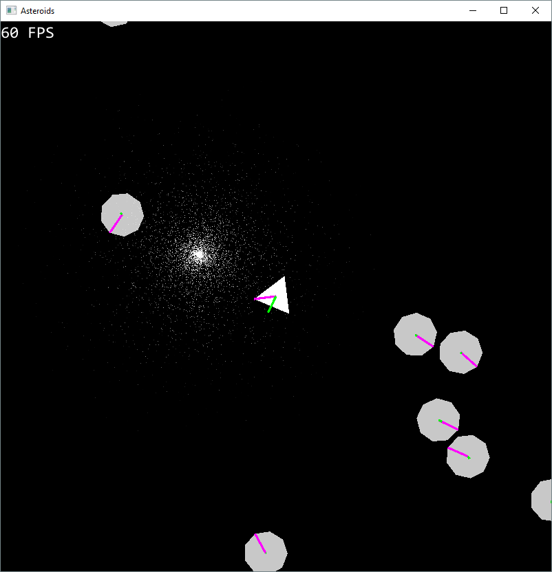

Asteroids
=========
Top-down space shooter



Dependencies
------------
* [SFML 2.1](http://www.sfml-dev.org/)

Building and Running
--------------------
* The working directory must be the location of the executable.
* When running from Visual Studio:
    * Set "Working Directory" to ```$(SolutionDir)..\..\Build\$(Configuration)\```
    * Set "Command" to ```$(SolutionDir)..\..\Build\$(Configuration)\$(TargetFileName)```
